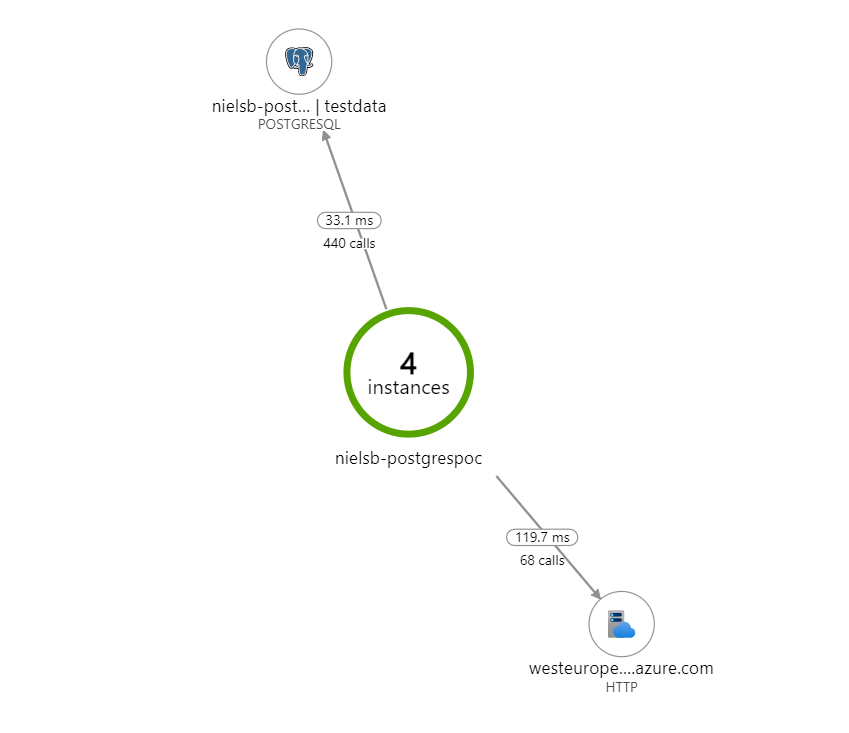

# opentelemetry-postgres-appinsights-demo
Demo code showing the use of OpenTelemetry sending Postgres traces to Application Insights

## What's this?
Azure Application Insights is used to monitor applications, providing the operator with, among others, a detailed view of ongoing errors, latency between components and query runtime. 
Getting traces from database queries is extremely useful for optimizing applications. Typically this is done by capturing the query response metadata from the database call and sending it off to a telemetry sink.
For Microsoft SQL, client SDKs such as Microsoft.Data.SqlClient natively have deep integration with Application Insights. 
However, when you use Postgres as a database the SDKs you use are not controlled by Microsoft and integration with App Insights is not something you can count on. 

To achieve the same level of telemetry collection, there are possibilities to instrument the SDKs yourself. For example, if you use Entity Framework you can use the [interceptor interfaces](https://docs.microsoft.com/en-us/ef/core/logging-events-diagnostics/interceptors) to hook into the query process and send data to Application Insights, as demonstrated [here](https://amuratgencay.medium.com/how-to-track-postgresql-queries-using-entityframework-core-in-application-insights-2f173d6c636d).
Not every SDK has that capability and there may be good reasons not to use EF.

Another way is to use [OpenTelemetry](https://opentelemetry.io/), a CNCF project aimed at improving telemetry exchange between languages, SDKs and platforms. This allows you to capture telemetry in your code and send it to a telemetry sink of your choice. Both .net core and Application Insights are supported.
There are already several good code samples out there (see links), but this specific repo contains an example of how to use .net core, OpenTelemetry and Postgres (through the npgsql SDK) together. 

Note that the Azure Monitor OpenTelemetry exporter is a preview release. It gives us distributed tracing, but still lacks many features included in the .net core Application Insights SDK. 
For that reason, this code implements both. To ensure the data sent through both channels appears as from the same source, we explicitly set the Cloud Role Name (AI) and the Service name (OT) to the same value.

Please treat this as a proof of concept. This code was written to demonstrate a very specific use case and lacks the proper exception handling, logging, retry logic, connection monitoring, factory patterns, etc. you need in a proper implementation, but those have been omitted here for clarity. 

## Links

- [OpenTelemetry Homepage](https://www.opentelemetry.io)
- [Microsoft's vision on Azure Monitor and OpenTelemetry](https://techcommunity.microsoft.com/t5/azure-monitor-blog/opentelemetry-azure-monitor/ba-p/2737823)
- [Tutorial: Enable Azure Monitor OpenTelemetry Exporter for .NET, Node.js, and Python applications (preview)](https://docs.microsoft.com/en-us/azure/azure-monitor/app/opentelemetry-enable?tabs=net)
- [ASP.net core OpenTelemetry sample](https://github.com/open-telemetry/opentelemetry-dotnet/tree/main/examples/AspNetCore)

## Screenshot
The end result will look something like this in the Application Insights application map. We even get an elephant!
